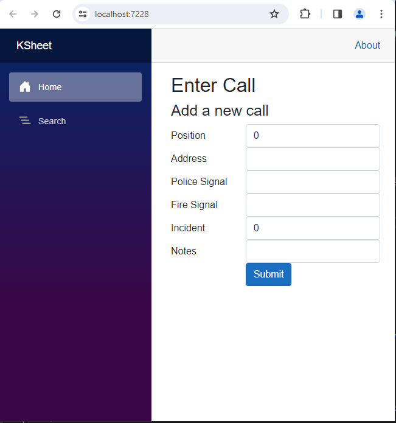
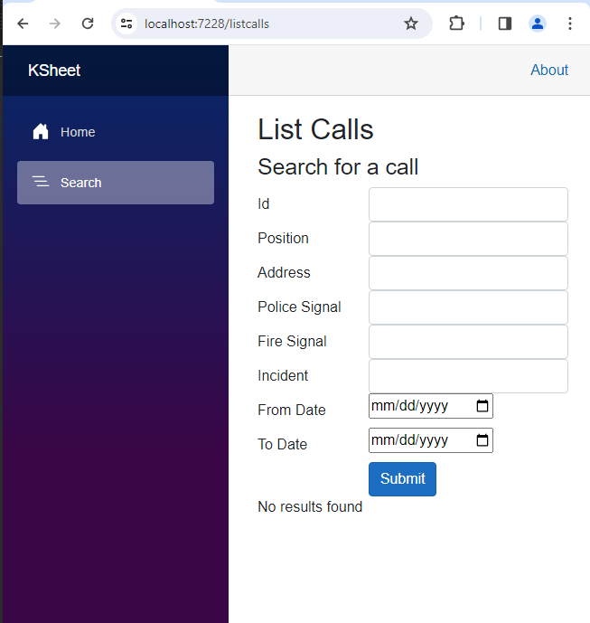
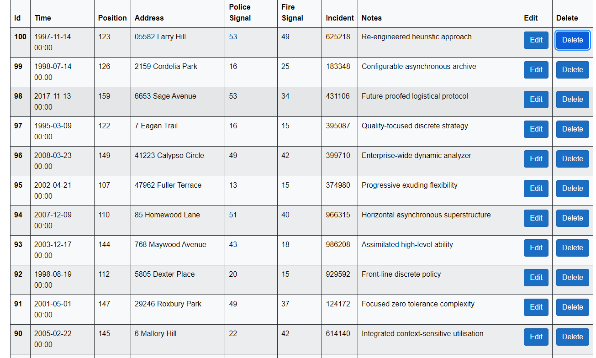

# KSheet

## Description

KSheet is an interactive web application made with Blazor used to log calls taken at a call center.

- This was made in an effort to save paper, trees and time!
- Allows the lead supervisors to quickly check calls 
- Enables faster searching instead of manually reading through physical sheets of paper.

## Table of Contents (Optional)

- [Installation](#installation)
- [Usage](#usage)
- [Credits](#credits)
- [License](#license)

## Installation

To open the project in a development environment, simply open the .sln file with Visual Studio and build. 

## Usage

In the main 'Home' screen, you can enter values such as the address, police signal, incident number and so on. Hitting submit will enter the call into the database.

In the 'Search' screen, you can attempt to look for a specific call using several fields. Be sure to enter as much information as possible for a more focused search.

Calls are displayed in a neat table.

## Credits

A huge thanks to [this](https://www.allhandsontech.com/programming/blazor/how-to-sqlite-blazor/) tutorial which really made the foundation for this application. I mostly repurposed it for a different use and added the searching functions. 

## License

The last section of a high-quality README file is the license. This lets other developers know what they can and cannot do with your project. If you need help choosing a license, refer to [https://choosealicense.com/](https://choosealicense.com/).

---

## Badges

## How to Contribute

Shoot me an email or create an issue!

